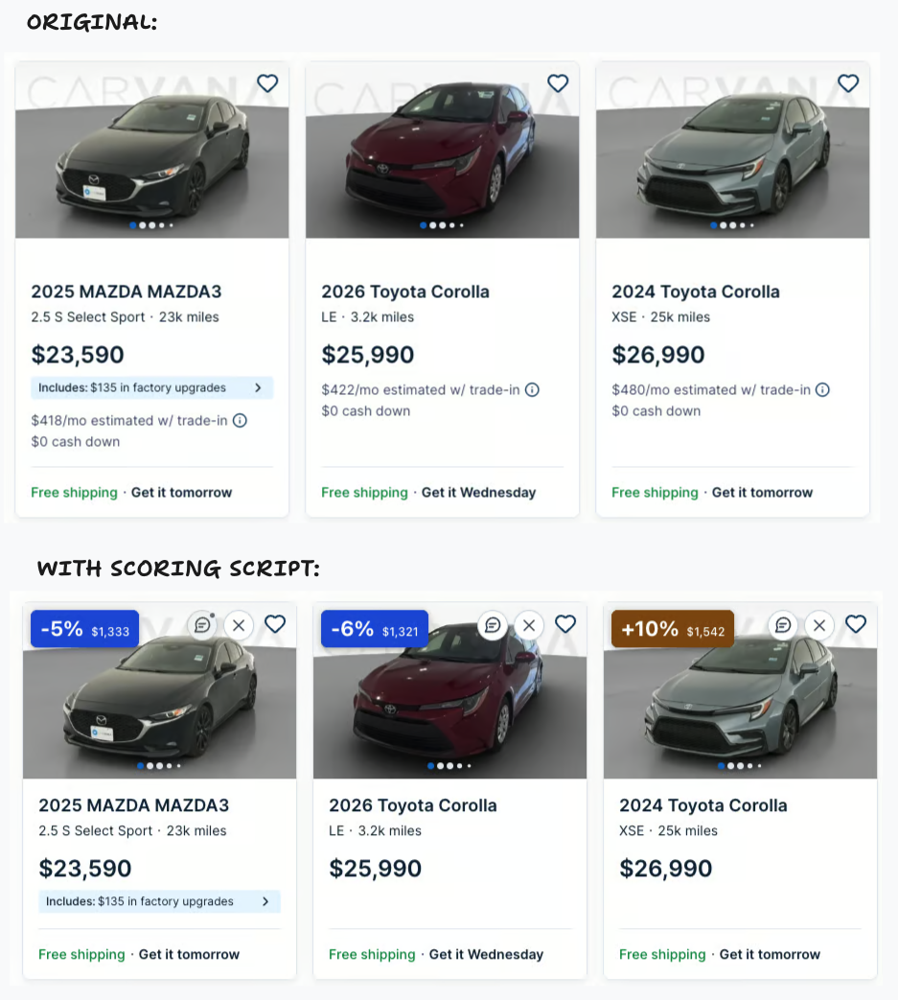

# Carvana Value Scorer

A browser script that scores Carvana listings for easy comparison. Just paste it into your browser’s console while browsing Carvana, and you’re off and running.

Each scored listing gets a color-coded badge showing its cost per **10,000 estimated remaining miles** and how that compares with your target. Lower is better. Shipping is included in both the score and the displayed price; taxes and other fees are excluded.



## Get Started

1. Go to [Carvana](https://www.carvana.com/cars) and search for cars. Wait for the listings to load.
2. Open [`carvana-score.js`](./carvana-score.js), select **Raw** if viewing it on GitHub, and copy the entire code.
3. Back on the Carvana results page, right-click an empty area and choose **Inspect**.
4. Select the **Console** tab in the developer tools panel.
5. Paste the script into the console and press **Enter**. Value badges will appear on eligible listings.
6. Close the developer tools panel. The script will continue running as you navigate that tab (just don't hit refresh)

## Keep Your Search Page Open

Keep searching in the original tab and open individual cars separately:

- **Windows or Linux:** hold **Ctrl** while clicking a car to open it in a new tab.
- **Mac:** hold **Command (⌘)** while clicking a car to open it in a new tab.

The script watches for changes and applies scores as listings load in the original page. It stays active as long as that page remains loaded. **If you refresh, navigate away, or open a fresh search page, paste the script again.** It does not automatically run in other tabs or windows.

## Notes and Hidden Cars

Use the comment bubble beside the heart to add notes, or **X** to dim a car you’ve ruled out. Click the restore arrow to unhide it. A small dot marks cars with notes.

**Ctrl+Enter** (or **Command+Enter** on Mac) saves notes.

Notes and hidden cars are remembered in this browser when you run the script again. They don’t sync across devices, and clearing Carvana’s site data erases them.

## Set Your Mileage Estimate and Price Target

Before running the script, adjust these two settings near the top of the file:

```js
const TARGET = 1400;
const MAX_MILES = 200000;
```

**`MAX_MILES` is the total odometer reading you expect the car to reach.** The default is 200,000 miles. A car currently at 80,000 miles therefore has 120,000 estimated miles remaining. Change this to match your expectations for the vehicles you are considering; it is an assumption, not a prediction of their lifespan.

**`TARGET` is your baseline price per 10,000 remaining miles.** Start with the default of **$1,400** as a comparison target, then adjust it to your budget and the kinds of cars you are shopping for. It is not a market appraisal or a universal definition of a good deal. At that target, a car with 100,000 estimated miles remaining would cost $14,000 including shipping.

To choose your own baseline, divide your desired vehicle-plus-shipping budget by the estimated remaining miles and multiply by 10,000. For example, a $15,000 budget for 100,000 remaining miles gives a $1,500 target.

After changing either setting, copy and run the entire script again. Rerunning it replaces the existing badges.

## Read the Badges

The score is calculated as:

```text
remaining miles = expected lifetime mileage − current mileage
cost per 10,000 miles = (vehicle price + shipping) ÷ remaining miles × 10,000
```

For a $15,000 car with $1,000 shipping and 100,000 miles on the odometer, the default 200,000-mile lifetime estimate gives a score of **$1,600 per 10,000 remaining miles**. Compared with the $1,400 target, the badge shows **+14%**.

- **Negative percentage:** below your target; blue (better than the baseline).
- **Zero percent:** approximately at your target, after rounding; green.
- **Positive percentage:** above your target; colors move from green through yellow and orange to red as the cost rises.

The smaller dollar amount in the badge is the cost per 10,000 remaining miles. Percentages are rounded to whole numbers.

## A Few Details

- A `*` beside the displayed price means paid shipping has been added. Hover over the price for the breakdown.
- Listings without readable price, mileage, or shipping information do not receive a score. Cars at or above your lifetime mileage estimate are also skipped.
- The script hides some promotional, financing, and shipping rows on listing cards to simplify the comparison.
- This compares purchase cost and estimated remaining mileage. It does not account for condition, maintenance, repairs, fuel, insurance, taxes, or other fees.

## License

[MIT](./LICENSE) — use, modify, and share it, including commercially, while retaining the license and copyright notice.

This is an independent project and is not affiliated with Carvana.
